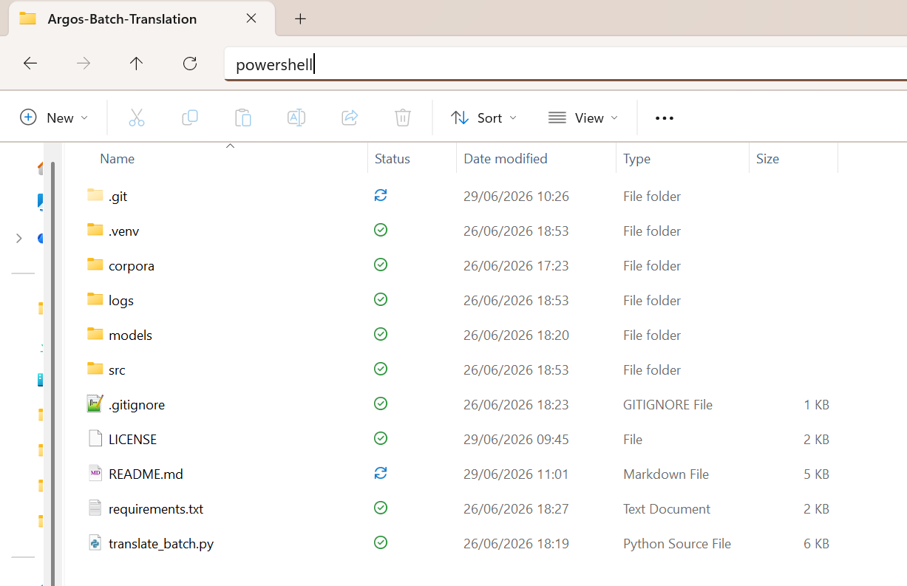

# Argos Batch Translation

This project batch-translates `.txt` files with Argos Translate.

The current default configuration translates Dutch to English.

---

## Installation

The steps below only need to be performed once per machine.

### 1. Install Python

Use Python 3.10 or newer. If you are unsure if it's already installed, open Windows Powershell or your system's terminal and run

```powershell
python --version
```

If you don't have Python installed yet, we recommend conda forge. You can download it [here](https://conda-forge.org/download/).

Alternatively, you can also install `uv` as explained in the next step and then install Python like so:

```powershell
uv python install
```

### 2. Install `uv`

If `uv` is not installed yet, run:

```powershell
powershell -ExecutionPolicy ByPass -c "irm https://astral.sh/uv/install.ps1 | iex"
```

Check that it works by opening a new Powershell or terminal window and run:

```powershell
uv --version
```

### 3. Download the code

You can either download the code and files as a ZIP archive or clone the project with git.

For downloading the code directly, click on the green "Code" button above and then select "Download ZIP". You then need to unpack the archive and move it to the location of your choice.

If you have git installed, please navigate Powershell/the terminal to the folder of your choice (see the next steps for instructions for that). Then run

```powershell
git clone https://github.com/StefKirsch/Argos-Batch-Translation.git
```

### 4. Create a virtual environment for the dependencies

Navigate Powershell/the terminal to the project folder. On Windows this can be done by 
1. navigating to that folder in the system explorer
2. typing `powershell` in the address bar
3. pressing `Enter`.



Once Windows Powershell/the terminal is open and pointing to the correct folder, create the a new virtual environment by running:

```powershell
uv venv
```

Then, activate it:

```powershell
.venv\Scripts\activate
```

If PowerShell blocks activation, run:

```powershell
Set-ExecutionPolicy -Scope Process -ExecutionPolicy Bypass
.venv\Scripts\activate
```

### 5. Install dependencies

In Powershell/the terminal run:

```powershell
uv pip install -r requirements.txt
```

## Usage

### 1. Add source files

Place your Dutch `.txt` files in:

```text
corpora/raw/
```

Example:

```text
corpora/raw/interview_01.txt
corpora/raw/interview_02.txt
...
```

### 2. Run the translation script

Open a terminal and navigate to the root of the project folder. On Windows you can do this in the same way as explained in the step where we created a virtual environment.

In the terminal/Powershell, run

```powershell
python translate_batch.py
```

The script will:

* download a suitable model if it is missing
* install the local model into Argos for the current session
* translate every `.txt` file in `corpora/raw/`
* write translated files to `corpora/translated/`

Example output files:

```text
corpora/translated/interview_01.en.txt
corpora/translated/interview_02.en.txt
...
```

### 3. Change the language pair

Open `translate_batch.py` and change:

```python
SOURCE_LANG = "nl"
TARGET_LANG = "en"
```

For example, German to English:

```python
SOURCE_LANG = "de"
TARGET_LANG = "en"
```

Please note that the script will download a new model for every new language pair.

### 4. Optional settings

For a CPU-only run:

```powershell
$env:ARGOS_DEVICE_TYPE = "cpu"
```

---

## Traceability Features

The project records information about the model, input files, output files, software environment, and translation run.

## Model archiving

If the required model is missing, the script downloads an Argos-compatible model and saves it locally:

```text
models/translate-nl_en.argosmodel
```

The model is then reused from the local `models/` folder in later runs. The model metadata is recorded upon downloading it in

```text
models/model_metadata.json
models/SHA256SUMS.txt
```

These files record:

* source language
* target language
* package version
* Argos version
* model file path
* model SHA-256 checksum
* selection rule used for choosing the model

### Translation manifest

Each translation run writes:

```text
logs/translation_manifest.json
```

This describes the overall translation run, including:

* creation timestamp
* source language
* target language
* input directory
* output directory
* model file
* model checksum
* Python version
* platform information
* installed package versions
* relevant environment variables

### Translation ledger

Each run writes:

```text
logs/translation_ledger.jsonl
```

This is a line-by-line audit log. Each line corresponds to one translated input document.

For every document, it records:

* input file path
* output file path
* source language
* target language
* model file
* model checksum
* timestamp
* input encoding
* input file SHA-256 checksum
* normalized source text SHA-256 checksum
* output file SHA-256 checksum
* source character count
* translation character count
* status
* error message, if any

### Error log

Failed translations are written to:

```text
logs/errors.jsonl
```

This makes it possible to inspect failed files separately without searching through the full ledger.

### File hashing

The project uses SHA-256 hashes for:

* the model file
* each raw input file
* each normalized source text
* each translated output file

This makes it possible to check whether any input, output, or model file changed after translation.

## Terms of Use

This code is licenced under the MIT license, which means its available for free and can be modified by anyone. When using this code for publications, please cite [Argos Translate](https://github.com/argosopentech/argos-translate/) as specified there. 

We recommend including this code, the model metadata and the translation logs in your datapackage for transparency.
